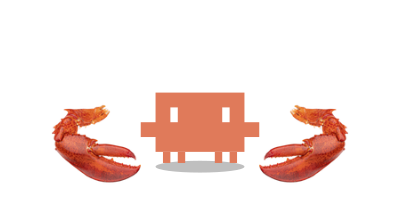
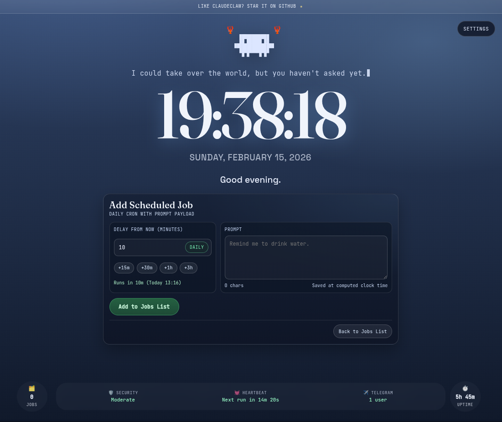
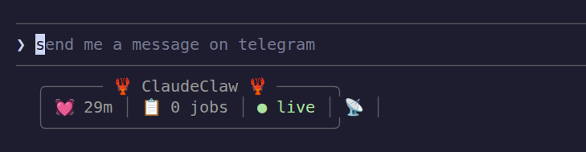

<p align="center">
  
</p>
<p align="center">
  
</p>

<p align="center">
  <a href="https://github.com/TerrysPOV/ClaudeClaw-Plus/stargazers">
    
  </a>
  <a href="https://github.com/TerrysPOV/ClaudeClaw-Plus/commits/main">
    
  </a>
  <a href="https://github.com/TerrysPOV/ClaudeClaw-Plus/graphs/contributors">
    
  </a>
  <a href="https://github.com/moazbuilds/claudeclaw">
    
  </a>
</p>

<p align="center"><b>ClaudeClaw, plus the heavy stuff. Governance, orchestration, persistent memory, hardened web UI.</b></p>

ClaudeClaw+ is a sister project to [`moazbuilds/claudeclaw`](https://github.com/moazbuilds/claudeclaw) — the lightweight Claude Code daemon you already know. Plus exists to house the features that are too heavy or too opinionated for the core repo: a full governance and policy layer, durable multi-step orchestration, persistent cross-session memory, and a hardened web UI.

Everything from upstream lives here too. ClaudeClaw+ syncs from upstream automatically every day, so you never fall behind.

> Note: Please don't use ClaudeClaw+ for hacking any bank system or doing anything illegal. Same rules apply.

---

## Standing on the shoulders of giants

ClaudeClaw+ is built on top of the original [`moazbuilds/claudeclaw`](https://github.com/moazbuilds/claudeclaw), created by [@moazbuilds](https://github.com/moazbuilds). The core daemon, Telegram/Discord adapters, heartbeat, web dashboard, skills system — all of that comes from upstream and the amazing contributors who built it.

**Upstream contributors — thank you:**

<a href="https://github.com/moazbuilds/claudeclaw/graphs/contributors">
  
</a>

### How the sync works

A GitHub Actions workflow (`.github/workflows/sync-upstream.yml`) runs at 07:00 UTC every day. It pulls `moazbuilds/claudeclaw master` and opens a PR if there are new commits. Every fix and feature that lands upstream is here within a day.

If you see a PR titled **"chore: sync upstream"** — that's the robot doing its job. Review it, resolve any conflicts if needed, and merge.

---

## Why ClaudeClaw+?

| Category | ClaudeClaw | ClaudeClaw+ | OpenClaw |
| --- | --- | --- | --- |
| Anthropic Will Come After You | No | No | Yes |
| API Overhead | Directly uses your Claude Code subscription | Same | Nightmare |
| Setup & Installation | ~5 minutes | ~5 minutes | Nightmare |
| Isolation | Folder-based and isolated as needed | Folder-based + per-agent scope | Nightmare |
| Reliability | Simple reliable system | Simple + durable workflows that survive restarts | Nightmare |
| Feature Scope | Lightweight features you actually use | Everything in ClaudeClaw, plus governance and orchestration | 600k+ LOC nightmare |
| Security | Average Claude Code usage | Policy engine, audit log, CSRF protection | Nightmare |
| Cost Control | Manual | Automatic token budgets + model routing per task type | Nightmare |
| Memory | Claude internal memory + `CLAUDE.md` | Persistent cross-session `MEMORY.md` with dual-layer write guarantee | Nightmare |
| Multi-step Jobs | Cron + heartbeat | DAG orchestrator with dependency resolution and resumable state | Nightmare |

---

## Getting Started in 5 Minutes

```bash
claude plugin marketplace add TerrysPOV/ClaudeClaw-Plus
claude plugin install claudeclaw-plus
```

Then open a Claude Code session and run:

```
/claudeclaw:start
```

The setup wizard covers model, heartbeat, Telegram, Discord, and security. Your daemon is live in under five minutes — same as upstream.

---

## What's in Plus that isn't in claudeclaw

These features originated as PRs to `moazbuilds/claudeclaw` and have been closed upstream — they're out of scope for the lightweight core and live here permanently. Links below point to the originating PRs so you can read the full rationale.

### Policy Engine — fine-grained tool governance

**[PR #71 — closed upstream — lives here](https://github.com/moazbuilds/claudeclaw/pull/71)**

Every tool call (Bash, Read, Edit, etc.) is evaluated against deterministic rules before execution. Rules can allow, deny, or gate behind operator approval — scoped by channel, user, skill, and source. Includes an audit log and a bounded LRU approval cache.

**Why:** Replaces blanket `--dangerously-skip-permissions` with actual governance. Operators can deny destructive tools in public channels, require approval for high-risk operations, and keep a tamper-evident audit trail for compliance.

---

### Governance Layer — model routing, budgets, watchdog

**[PR #72 — closed upstream — lives here](https://github.com/moazbuilds/claudeclaw/pull/72)**

Sits between the daemon and Claude CLI. Automatically routes planning tasks to Opus and implementation tasks to Sonnet. Tracks token and cost spend per session and globally, with configurable warn/throttle/block states. Watchdog kills runaway sessions before they drain your credits.

**Why:** Stops cost overruns before they happen. Makes ClaudeClaw safe to leave unattended — the thing that needs a babysitter becomes the babysitter.

---

### Gateway, Events & Escalation — unified ingestion and replayable event log

**[PR #73 — closed upstream — lives here](https://github.com/moazbuilds/claudeclaw/pull/73)**

Unified message ingestion pipeline normalises Discord/Telegram messages to a common format. Crash-safe append-only event log, retry queue with exponential backoff, dead-letter queue, full event replay, and an escalation framework (pause session, hand off to a human, notify across channels).

**Why:** Eliminates duplicated per-adapter logic and gives you an audit trail you can replay. When something goes wrong at 3am, you can see exactly what happened and re-run it.

---

### Orchestrator — DAG task graph and resumable jobs

**[PR #74 — closed upstream — lives here](https://github.com/moazbuilds/claudeclaw/pull/74)**

Multi-step task execution via dependency graph with topological sort. Durable workflow state with atomic writes. Jobs survive daemon restarts mid-execution. Governance-integrated executor with configurable parallelism.

**Why:** Complex requests decompose into dependent subtasks that run in parallel where possible and resume exactly where they left off after a crash. No more lost work.

---

### CSRF Protection for Web UI

**[PR #75 — closed upstream — lives here](https://github.com/moazbuilds/claudeclaw/pull/75)**

Cryptographically random single-use UUID tokens per session, timing-safe comparison, conditional `Secure` cookie flag, and a client-side `mutatingFetch()` wrapper that auto-retries on 403.

**Why:** Prevents malicious cross-origin pages from triggering heartbeat toggles, job runs, or chat actions in an operator's logged-in browser — hardening on top of whatever reverse-proxy auth you're running.

---

### Persistent Memory — cross-session `MEMORY.md`

**[PR #77 — closed upstream — lives here](https://github.com/moazbuilds/claudeclaw/pull/77)**

`MEMORY.md` loaded into `--append-system-prompt` on every invocation. Dual-layer write guarantee: Claude is instructed to write after each task, and a daemon-side fallback appends a log entry if `MEMORY.md` is unchanged after a run. Pre-compact and pre-shutdown saves, 200-line cap with auto-trim, per-agent memory paths.

**Why:** Sessions stop being amnesiac. Claude remembers prior work across restarts, compactions, and crashes — making long-running deployments coherent.

---

### Multi-Session Discord Threads

Each Discord thread gets its own Claude CLI session, fully isolated. Thread conversations run concurrently without blocking each other. First message in a new thread bootstraps a fresh session automatically.

See [docs/MULTI_SESSION.md](docs/MULTI_SESSION.md) for technical details.

---

### Daemon Plugin API

**[PR #144 — closed upstream — lives here](https://github.com/moazbuilds/claudeclaw/pull/144)**

OpenClaw-compatible lifecycle events at the daemon level — `gateway_start`, `before_agent_start`, `before_prompt_build`, `tool_result_persist`, `agent_end`, and more. Plugins hook in via `api.on()`, `api.registerService()`, and `api.registerCommand()`. Includes path traversal prevention, SSRF-safe health checks, and fire-and-forget async emission.

**Why:** Lets external code extend the daemon without modifying it — memory systems, observability, custom routing, anything.

---

## All the things from upstream

Everything ClaudeClaw ships, Plus ships too:

- **Heartbeat** — periodic check-ins, configurable intervals, quiet hours
- **Cron Jobs** — timezone-aware schedules, one-time and repeating
- **Telegram** — text, image, and voice support
- **Discord** — DMs, server mentions/replies, slash commands, voice, images
- **GLM Fallback** — continue with GLM models when your primary limit is hit
- **Web Dashboard** — manage jobs, monitor runs, inspect logs in real time
- **Security Levels** — four access levels from read-only to full system access
- **Skills & Plugins** — folder-based, isolated as needed

---

## Contributing

Big ideas welcome. See [CONTRIBUTING.md](CONTRIBUTING.md) for the full guide.

Short version: open an issue or discussion first, then the PR. Large refactors fine. Opinionated changes fine. Multi-file stacks fine. Just talk first, code second.

---

## Roadmap

Watch the [Issues](https://github.com/TerrysPOV/ClaudeClaw-Plus/issues) tab for upcoming work. Want to propose something? Open a discussion — all ideas welcome.

---

## FAQ

<details open>
  <summary><strong>Is this a hard fork?</strong></summary>
  <p>
    No. ClaudeClaw+ syncs from <a href="https://github.com/moazbuilds/claudeclaw">moazbuilds/claudeclaw</a> every day.
    Upstream fixes land here within 24 hours. It's a sister project — same foundation, wider scope.
  </p>
</details>

<details open>
  <summary><strong>Will features here go back upstream?</strong></summary>
  <p>
    Unlikely for the Plus-exclusive features — they've been closed upstream as out-of-scope for the lightweight core.
    <a href="https://github.com/moazbuilds">@moazbuilds</a> decides what fits the lightweight core.
    Whether they get merged upstream or not, they're available here today.
  </p>
</details>

<details open>
  <summary><strong>Why not just keep these as PRs upstream?</strong></summary>
  <p>
    Six PRs totalling ~55,000 lines of additions need a home where they can actually be used.
    Sitting as open PRs with no activity doesn't help anyone.
    ClaudeClaw+ is that home.
  </p>
</details>

<details open>
  <summary><strong>Is this breaking Anthropic ToS?</strong></summary>
  <p>
    No. Same answer as upstream: ClaudeClaw+ is local usage inside the Claude Code ecosystem.
    It wraps Claude Code directly and does not require third-party OAuth outside that flow.
  </p>
</details>

<details open>
  <summary><strong>Will Anthropic / @moazbuilds sue you for building ClaudeClaw+?</strong></summary>
  <p>
    I hope not.
  </p>
</details>

---

## Screenshots

### Web Dashboard


### Claude Code Status Bar


---

## Contributors

Thanks for building ClaudeClaw+.

<a href="https://github.com/TerrysPOV/ClaudeClaw-Plus/graphs/contributors">
  
</a>
</content>
